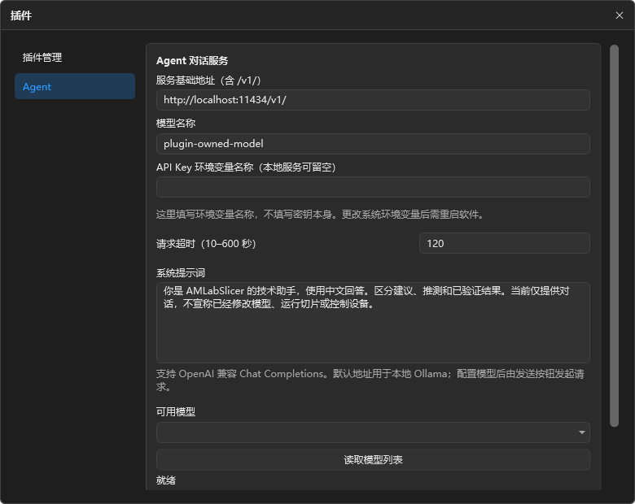
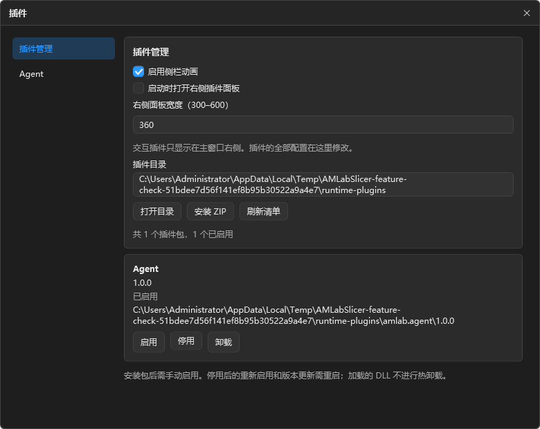
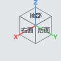
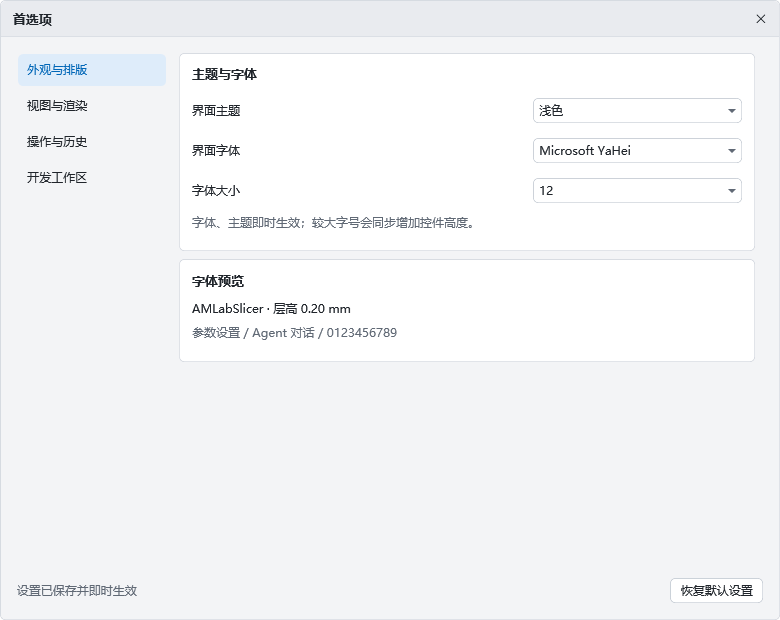
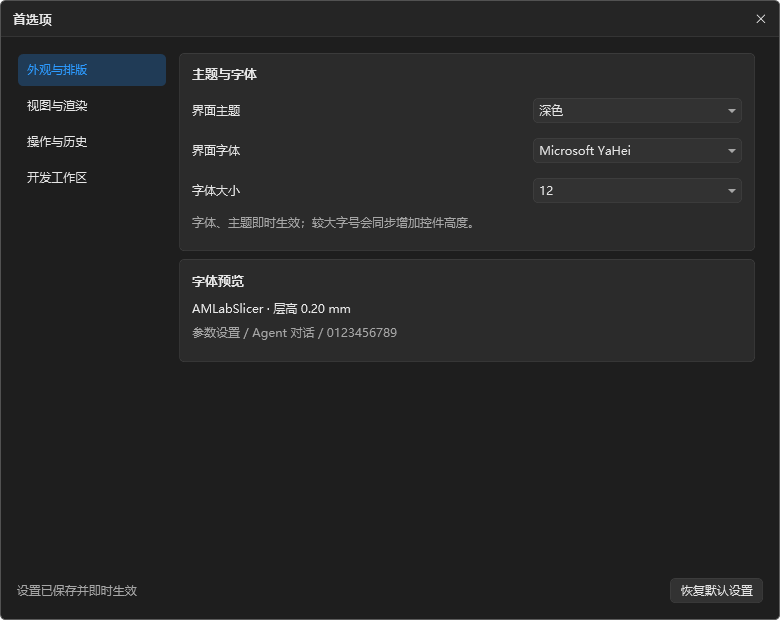
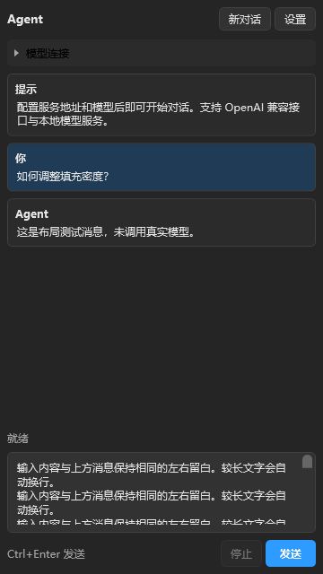
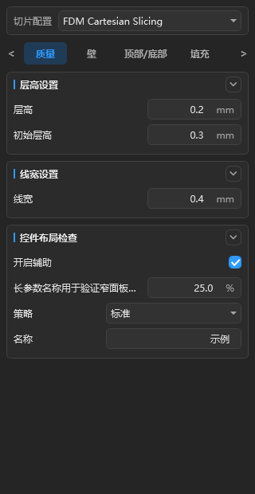

# 当前插件界面预览

Agent 现为独立 DLL 插件，右侧仅保留对话与只读模型摘要；所有配置移至顶部“插件”窗口。插件管理支持 ZIP 安装、启用、停用及卸载。以下 PNG 来自实际 WPF 回归渲染，Agent 模型名和目录为测试数据，未连接真实模型。模型预览离屏渲染不代表 GPU 运行验收。

- extensions-agent.png：插件提供的 Agent 设置页。
- extensions-manager.png：宿主插件管理页。
- workspace-panels.png：右侧插件面板和切换栏。

详细规范见 ../PLUGIN_DEVELOPMENT_STANDARD.md。

## 较早验证记录（历史实现，当前行为以插件规范为准）

# UI 样式调整与验证记录

日期：2026-10-09。设计依据：[UI 设计标准](../UI_DESIGN_STANDARD.md)。

## 2026-10-10 首选项与 Agent 窗口

### 后续修复：统一弹窗、立方体对比度与窗口缩放

新增顶部“拓展”菜单与独立窗口，Agent 相关设置从首选项移出，另有拓展管理页读取目录中的元数据。侧侧常驻 32 DIP 面板切换栏，末尾“＋”打开管理页；当时只内置 Agent。侧上显示/隐藏按钮取消焦点背景与虚线，保留悬停效果。验证入口跳转、两页/两套主题、有效与损坏清单处理、首选项恢复默认保留 Agent 设置、面板内容切换及包含切换栏的缩放宽度预算。拓展窗口预览中包名为测试数据，没有安装或运行真实插件。

最终工作区调整为独立区域：模型列表、参数区、模型预览与 Agent 各自圆角 5，区域间隙与外围留白均为 4 DIP。分隔条默认透明，悬停显示拖动反馈；左侧上下区域分别裁切。宽度检查扣除外围左侧共 8 DIP 后执行，反复缩放回归仍通过；工作区预览已更新，中央 GPU 离屏画面的证据限制仍适用。

Agent 输入框已统一为 8 DIP 内边距，移除 TextBox 模板中重复叠加的宿主 Margin。面板预览包含实际输入文字；回归检查通过。

所有应用内 ScrollBar 改为透明轨道与细灰色圆角滑块，移除原生浅色轨道和箭头；浅色主题同步适配。Agent 预览使用长输入显示真实滚动条。通过 WPF 路由拖动事件检查文本输入框纵向滚动和内容横向滚动，并验证轨道翻页命令会继续增加偏移；不等同于真实鼠标操作验收。

- 首选项、应用内信息/参数警告和操作确认窗口共用主题标题栏、关闭入口、边框与按钮；验证浅色/深色警告窗口的颜色及关闭命令，实际窗口渲染预览已更新。文件选择与保存仍使用系统原生对话框。
- 按最终要求，视角立方体保持透明面，浅色主题采用灰色文字及边线，深色主题采用浅灰文字及边线。下图来自实际 2D Cube Canvas 的投影渲染，不涉及 GPU 模型渲染。
- 缩放检查先复现：内部 Grid 在窗口缩到 1280 时仍被旧侧栏撑到 1518.4 DIP。修复后在 Measure/Arrange 前按父布局分配的宽度同时约束两侧，避免使用溢出的内部实际宽度。
- 测试三轮“大窗口 1800 下将侧栏调为 620/590 → 1280 → 960 → 1100 → 960”，均验证两侧最小宽度、中央至少 300、宽度总和与列宽/渲染宽度一致；另验证收起侧栏在缩放后保持零宽。测试直接设置列宽模拟调宽，不代替完整鼠标拖动验收。
- 本轮回归与 UI x64 构建通过。程序当前运行的旧实例仍需关闭并重新编译启动。

修复主窗口第 26 行的启动异常：将行定义高度由 `Double` 动态资源改为独立的 `GridLength` 资源。新增检查先复现原始 `XamlParseException / InvalidCastException`，修复后实际构造并显示测试主窗口，再验证默认行高 36、字号 20 时行高 44、恢复字号后行高 36；全部通过。该检查未启动应用服务或调用切片引擎。

- 首选项改为四个分类；增加浅色主题、系统字体、字号、平台网格、视图状态、侧栏动画、启动展开和对话服务配置，设置保存到 JSON。
- 侧侧镜像图标打开 Agent 面板，两侧独立展开/收起；支持调整宽度、连续对话、新对话、发送、取消和模型列表读取。扩展仅预留接口与便携目录，没有预装或加载插件。
- 最终 x64 UI 构建零警告、零错误，回归检查通过。网络使用模拟 HTTP 响应，覆盖成功、认证失败、取消和切换模型；没有真实模型服务验收。
- 使用实际 WPF 首选项创建远离桌面可视区域的测试窗口，验证已创建控件的动态主题更新并渲染四个分类、两套主题。其余预览为离屏布局；工作区中央 GPU 画面未参与验证，不能把其黑色区域判断为实际视图区表现。
- 回归检查覆盖 960 DIP 工作区下打开侧侧面板、恢复宽度及左侧独立控制。没有把离屏布局检查当作完整鼠标拖动、动画或系统 DPI 验收。
- 实现与配置说明：[Agent 对话与便携扩展基础](../AGENT_CHAT_AND_PORTABLE_EXTENSIONS.md)。当前运行的旧程序需要关闭并重新构建/启动，才能加载新代码。

## 本次变更

- 深灰背景层级、文字、边框和选中颜色统一到主题资源。
- 卡片、常规控件、工具栏和窗口圆角统一为 5，保留滑块及复选框自身的几何设计。
- 参数标题与内容合并为完整卡片：标题 30、参数行 32、输入外框 26；内部无边框数值编辑器为 24，留给外框上下各 1 的边框空间。
- 分类导航采用淡蓝选中背景与蓝色文字；分组标题左侧添加竖线，整行作为展开/收起按钮，侧侧箭头仅指示状态。
- 共用输入模板传递 Padding 和垂直内容对齐，并区分中性悬停与蓝色焦点。
- 视图区工具按钮、输入框和开始切片按钮压缩为标准高度。
- 首选项加入滚动区域，压缩标题与间距，使底部设置可访问。
- 无文字复选框不再预留文字间距，移除参数复选框的额外侧边距，使可见方框与其他输入控件侧边缘对齐。

## 验证与证据边界

- UI x64 构建通过，零警告、零错误；`git diff --check` 通过。
- 临时 WPF 检查程序加载实际编译后的主题、参数面板、首选项和主窗口资源。
- 使用示例参数覆盖 NumericBox、Slider、CheckBox、ComboBox、TextBox；在面板宽度 280、320、440 下完成离屏渲染及编辑器尺寸检查。
- 检查实际分组命令的收起与展开，数值合法输入的绑定更新，下拉选择和勾选框的绑定更新，以及首选项滚动至底部。
- 标题左侧、中央空白与侧侧的 WPF 视觉命中检查通过，整行按钮的点击入口可执行原有命令并切换内容显示；未替代真实鼠标/键盘交互验收。
- 在面板宽度 280、320、440 下检查复选框可见方框与参数下拉框的侧边缘坐标，分别同为 263、303、423 DIP；绑定检查仍通过。
- 后续修改时运行中的 AMLabSlicer 锁住了常规输出 DLL；使用临时独立输出目录完成最终 UI 构建，零警告、零错误。正在运行的窗口仍加载旧版本，需要关闭后重新构建/启动才能看到更新。
- 渲染生成了 100%、125%、150% 比例图；这些是离屏位图输出比例，不等于真实系统 DPI 切换验收。
- 未验证完整应用窗口的实际鼠标/键盘焦点、全部悬停和禁用状态、系统缩放、窗口调整大小、真实模型或切片流程。越界数值提示弹窗未做完整交互验收。
- 首次临时检查程序因错误使用离屏控件的 `IsVisible` 判断而异常退出，产生了名为 Review 的错误弹窗；已修正可见性检查并加入异常捕获，最终检查正常退出。该错误不构成 AMLabSlicer 主程序崩溃的证据。

## 参数面板预览

以下由实际 WPF 参数面板渲染，使用示例数据；“控件布局检查”为测试分组，不是新增的产品参数。

